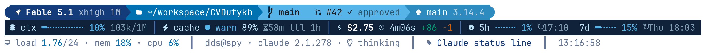

# my-cli-config

> Personal, machine-independent CLI configuration — a polished [Claude Code](https://code.claude.com)
> status line and a [Starship](https://starship.rs) prompt, installed by symlink so every machine
> stays in sync with a `git pull`.

[](LICENSE)
[](https://www.gnu.org/software/bash/)
[](#requirements)

## Preview

**Claude Code status line** — identity, telemetry, system:

<picture>
  <source media="(prefers-color-scheme: dark)" srcset="docs/claude-statusline-dark.png">
  
</picture>

**Starship prompt** — blue powerline, readable on light and dark terminals:

<picture>
  <source media="(prefers-color-scheme: dark)" srcset="docs/starship-prompt-dark.png">
  
</picture>

## Quick start

```bash
git clone https://github.com/dutykh/my-cli-config.git ~/workspace/my-cli-config
~/workspace/my-cli-config/install.sh
```

Clone it wherever you like — nothing hardcodes `~/workspace`. Each installer resolves its own
location from `${BASH_SOURCE[0]}`, so `~/dotfiles`, `~/src/my-cli-config` or anywhere else works
just as well. Re-running the installer is always safe.

To install a single component instead of all of them:

```bash
~/workspace/my-cli-config/claude/install.sh      # status line only
~/workspace/my-cli-config/starship/install.sh    # prompt only
```

## What's inside

Each top-level folder is one self-contained component with its own `install.sh` and its own
README; the root `install.sh` simply runs them all.

| component | what it configures |
|---|---|
| [`claude/`](claude/README.md) | Claude Code status line (3 lines, Nerd Font / emoji icons, light-dark aware, colour-blind-safe) |
| [`starship/`](starship/README.md) | Starship blue powerline prompt (Nerd Font icons, light-dark readable) |

## How it works

Everything is installed by **symlink**, never by copy. `~/.claude/statusline-command.sh` and
`~/.config/starship.toml` point back into your clone, so updating every machine is one `git pull` —
no re-running the installer, no drift between machines.

Three guarantees make re-running safe:

* **Per-machine files are seeded, never overwritten.** `~/.claude/statusline.conf` is copied once if
  it does not exist. Your local tweaks survive every update, while the shared code stays shared.
* **Anything replaced is backed up first.** An existing `~/.claude/settings.json`, or a real (non-symlink)
  `~/.config/starship.toml`, is copied to a timestamped `*.bak.<date>-<time>` next to it before anything
  is written.
* **Your shell rc files are never edited.** If Starship is not yet active, the installer *prints* the
  one line to add and leaves the decision to you.

## Requirements

| component | required | optional |
|---|---|---|
| `claude/` | `bash ≥ 4.3`, `git`, [`jq`](https://jqlang.github.io/jq/) | a [Nerd Font](https://www.nerdfonts.com/) selected in the terminal; `timeout` / `gtimeout` for the git-status guard |
| `starship/` | [`starship`](https://starship.rs) on `PATH` | a Nerd Font (strongly recommended — the theme is built from Nerd Font glyphs) |

Linux and macOS are both supported. Without a Nerd Font, icons fall back to emoji automatically;
without `/proc` (macOS) the system line shows load only. Each installer checks its own requirements
and exits with an actionable message if something is missing.

## Uninstall

Nothing is installed outside `~/.claude/` and `~/.config/`, so removal is two commands per component.

```bash
# Claude Code status line
rm ~/.claude/statusline-command.sh                  # the symlink
jq 'del(.statusLine)' ~/.claude/settings.json > ~/.claude/settings.tmp \
  && mv ~/.claude/settings.tmp ~/.claude/settings.json
rm ~/.claude/statusline.conf                        # optional — your per-machine knobs

# Starship prompt
rm ~/.config/starship.toml                          # the symlink
```

To go back to a pre-existing config instead, restore the backup the installer kept:
`ls ~/.claude/settings.json.bak.*` or `ls ~/.config/starship.toml.bak.*`.

## Make it yours

The colours, icons and choice of segments are one person's taste — you are very welcome to disagree
with them. Two levels of customisation are supported:

* **Knobs, no forking.** `~/.claude/statusline.conf` turns segments on and off and sets the icon mode,
  theme, number of lines and gauge widths. It is per-machine and never overwritten, so `git pull`
  keeps your settings. Preview any change instantly with
  `bash ~/.claude/statusline-command.sh --demo`.
* **Fork and re-theme.** For a different palette or layout, fork the repo and edit
  `claude/statusline-command.sh` / `starship/starship.toml` directly. That is the expected way to make
  it your own — see [CONTRIBUTING.md](CONTRIBUTING.md) for what belongs upstream and what belongs in
  a fork.

## Contributing

Bug fixes, portability patches and documentation improvements are welcome — see
[CONTRIBUTING.md](CONTRIBUTING.md). Theme preferences are best kept in a fork.

## Author

**Dr. Denys Dutykh**
Mathematics Department, Khalifa University, Abu Dhabi, UAE

* Homepage — <https://www.denys-dutykh.com/>
* GitHub — [@dutykh](https://github.com/dutykh)
* ORCID — [0000-0001-5247-2788](https://orcid.org/0000-0001-5247-2788)

## License

Released under the [MIT License](LICENSE). © 2026 Denys Dutykh.
