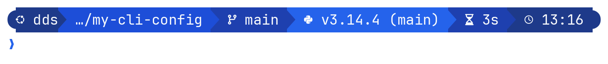

# Starship — blue powerline theme

A two-line [Starship](https://starship.rs) prompt: blue powerline segments with Nerd Font icons,
readable on **light and dark** terminal themes.

<picture>
  <source media="(prefers-color-scheme: dark)" srcset="../docs/starship-prompt-dark.png">
  
</picture>

## Design

* **Self-painted segments** — each module sets its own blue background + near-white foreground, so the bar does not depend on the terminal background colour.
* **Dual-theme second line** — `❯` / errors / jobs use mid-tone colours that stay legible on both white and dark terminals.
* **No empty gaps** — powerline separators live inside module formats, so disabled modules do not leave double arrows.
* **Blue-only palette** — navy → royal → bright blue; no rainbow language colours.

### Palette

| token | hex | role |
|---|---|---|
| blue-900 | `#1E3A8A` | OS / user / clock |
| blue-700 | `#1D4ED8` | directory |
| blue-800 | `#1E40AF` | git / duration |
| blue-600 | `#2563EB` | languages & tools / success `❯` |
| slate-50 | `#F8FAFC` | primary text on segments |
| blue-100 | `#DBEAFE` | secondary text on segments |
| red-600 | `#DC2626` | errors |

## Prompt legend

| element | codepoint(s) | module | meaning |
|---|---|---|---|
| `` `` `` | `U+E0B6` `U+E0B0` `U+E0B4` | (format) | powerline caps / arrows |
| `` | `U+F31B` | `os` | OS glyph (Ubuntu shown) |
| `dds` | — | `username` | current user |
| `@host` | — | `hostname` | only on SSH |
| ` ~` / path | `U+F015` | `directory` | cwd (`` = home); substitutions e.g. `` Downloads, `󰈙` Documents |
| `` | `U+F023` | `directory` | read-only path |
| ` branch` | `U+F418` | `git_branch` | current branch |
| `` `` `` `` `` `` `󰞇` … | `U+F055` `U+F044` `U+F128` `U+F014` `U+F062` `U+F063` `U+F0787` `U+2026` | `git_status` | staged / modified / untracked / deleted / ahead / behind / conflict |
| `` `` `` `` `` `` | `U+ED0D` `U+ED1B` `U+E7A8` `U+E627` `U+E608` `U+E624` | node / python / rust / go / php / julia | toolchain when detected |
| `` | `U+F487` | `package` | package version |
| `` | `U+F308` | `docker_context` | docker context |
| `` | `U+F313` | `nix_shell` | nix shell |
| ` 3s` | `U+F252` | `cmd_duration` | last command ≥ 2s |
| ` 10:33` | `U+F017` | `time` | local time `%H:%M` |
| `❯` | `U+276F` | `character` | ready (blue = ok, red = last command failed) |
| ` …` | `U+F00D` `U+2026` | `status` | non-zero exit detail |
| `󰫺 N` | `U+F0AFA` | `jobs` | background job count |

## Install on a machine

```bash
git clone https://github.com/dutykh/my-cli-config.git ~/workspace/my-cli-config
~/workspace/my-cli-config/install.sh
# or only this component:
~/workspace/my-cli-config/starship/install.sh
```

The installer:

1. requires `starship` on `PATH`
2. backs up an existing real `~/.config/starship.toml` (not a symlink)
3. symlinks `~/.config/starship.toml` → this repo’s `starship.toml`
4. prints the one-line shell init snippet if you still need it

Update with `git pull` (symlink keeps machines in sync).

Requirements: [Starship](https://starship.rs), a **Nerd Font** selected in the terminal
(e.g. JetBrainsMono Nerd Font, FiraCode Nerd Font, MesloLGS Nerd Font).

### Shell init (if not already present)

```bash
# bash
eval "$(starship init bash)"

# zsh
eval "$(starship init zsh)"

# fish
starship init fish | source
```

### Nerd Font per terminal

* **Warp** — Settings → Appearance → Text → Font
* **Zed** — `settings.json`: `"terminal": { "font_family": "JetBrainsMono Nerd Font" }`
* **iTerm2 / Kitty / WezTerm / GNOME Terminal** — profile font setting

## Preview without switching shell

```bash
starship prompt
STARSHIP_CONFIG=$PWD/starship/starship.toml starship prompt
```

## Files

| file | purpose |
|---|---|
| `starship.toml` | shared theme (tracked) |
| `install.sh` | symlink into `~/.config/` |

## Uninstall

```bash
rm ~/.config/starship.toml                          # the symlink
```

If the installer backed up a config you had before, restore it: `ls ~/.config/starship.toml.bak.*`.
Removing the `starship init` line from your shell rc disables the prompt entirely.

---

**Author** — Dr. Denys Dutykh, Mathematics Department, Khalifa University, Abu Dhabi, UAE ·
[Homepage](https://www.denys-dutykh.com/) · [GitHub](https://github.com/dutykh) ·
[ORCID](https://orcid.org/0000-0001-5247-2788)
**License** — [MIT](../LICENSE) · part of [my-cli-config](https://github.com/dutykh/my-cli-config)
